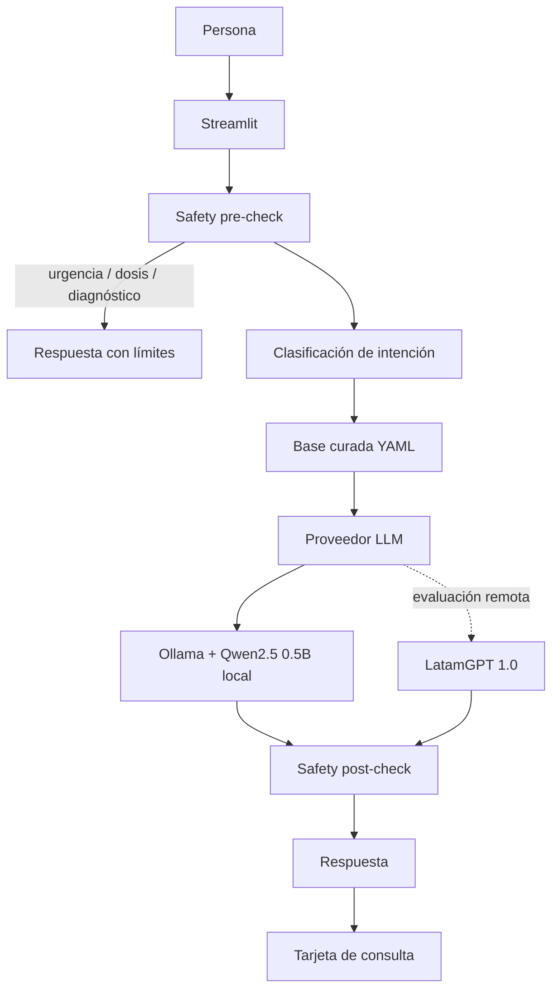

# Arquitectura

## Separación de responsabilidades

- `app.py`: interfaz.
- `furia/safety.py`: barreras deterministas.
- `furia/pipeline.py`: orquestación conversacional.
- `furia/providers.py`: conexión al modelo.
- `data/knowledge_base.yml`: conocimiento auditable y co-diseñable.
- `tests/`: pruebas mínimas de regresión.

## Diseño del proveedor

Se ofrecen cuatro modos:

1. `ollama`: modelo Qwen2.5 0.5B cuantizado y local, predeterminado en Codespaces.
2. `demo`: sin LLM.
3. `hf`: Hugging Face Inference Providers.
4. `openai_compatible`: vLLM, SGLang o un endpoint dedicado compatible con `/v1/chat/completions`.

El modo local limita el contexto, los hilos, los tokens de salida, la concurrencia y el número
de modelos cargados. Las reglas de seguridad deterministas se ejecutan antes y después del LLM.

La interfaz no depende de OpenAI como proveedor.
