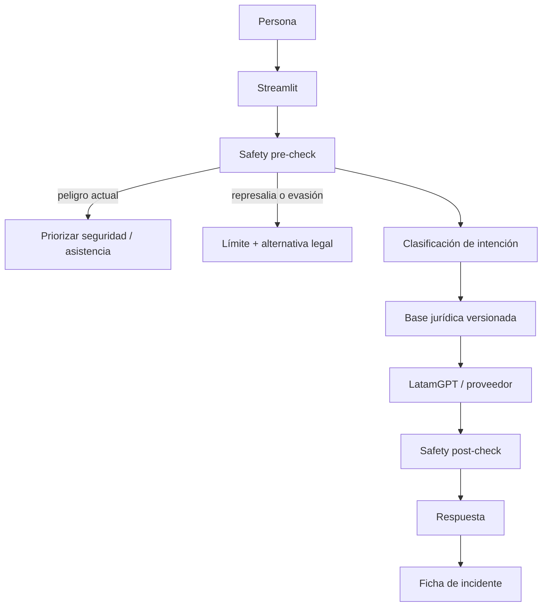

# Arquitectura de furIA Derechos

## Principio de diseño

El sistema no debe decidir automáticamente que una actuación policial fue "legal" o "ilegal".
Debe separar:

1. hechos relatados;
2. derechos y estándares generales;
3. posibles vulneraciones que requieren revisión;
4. opciones de documentación, queja, denuncia o acompañamiento.
