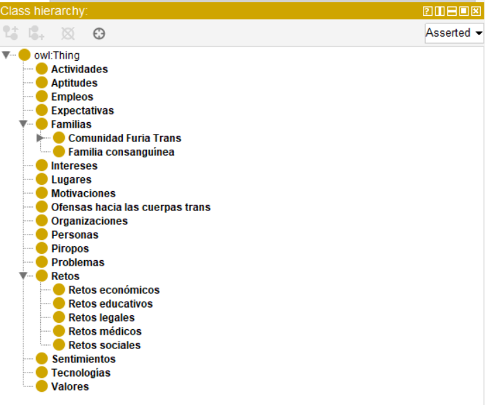

# ontologia-furia 
@prefix : <https://furiatecnologiatravesti.org/ontologiaFuriaTrans//> .

**URI oficial:** `https://furiatecnologiatravesti.org/ontologiaFuriaTrans/`  
**Formatos:** OWL (RDF/XML)

**Licencia:** comunidad FurIA

## Propósito y Alcance
Esta ontología es uno de los resultados del proyecto “furIA: construcción de tecnología IA feminista junto a trabajadoras sexuales trans en Ecuador” en su etapa semilla, financiado por la Red Feminista de Inteligencia Artificial de América Latina y el Caribe. 

Junto con la caracterización de clases, relaciones e instancias, ontologia-furia contiene un vocabulario travesti construido a partir de técnicas de Procesamiento de Lenguaje Natural (PLN) aplicadas a las palabras encontradas en materiales recolectados y producidos por integrantes de la Fundación tales como imágenes, fotografías, textos y audios durante tres talleres realizados en Quito, Machala y Lago Agrio durante Marzo y Abril del 2026. Estos talleres fueron conducidos por integrantes de la junta directiva de la Fundación y del Observatorio de Plataformas.


## Jerarquía de clases
Aquí se muestra la jerarquía de las clases que se obtuvieron una vez realizado el análisis del vocabulario.



## Clases Principales
* `:Persona`: Representa a los individuos que conforman las diferentes relaciones con las clases.
* `:Familia`: con la subclase: Comunidad Furia trans, que representan a las personas que tienen una relación de vínculo con la comunidad por conveniencia, afinidad o adopción.

## Explorador local

Esta carpeta incluye una aplicación Streamlit para explorar la ontología sin modificar el RDF y sin enviar información a servicios externos.

### Funciones

- resumen de clases, propiedades, individuos, entidades y triples;
- búsqueda por etiqueta, nombre local o URI;
- ficha de cada entidad con relaciones entrantes y salientes;
- jerarquía interactiva de clases por `rdfs:subClassOf`;
- grafo filtrable por predicados;
- consultas SPARQL `SELECT`;
- exportación de relaciones, resultados y vocabulario en CSV;
- controles de calidad para etiquetas, dominio, rango, clases aisladas y URI inconsistentes;
- carga opcional de otros archivos RDF/XML, OWL, Turtle, N-Triples o JSON-LD.

### Ejecutar en local

Requiere Python 3.11 o posterior.

```bash
cd furia-ontologia
python -m venv .venv
source .venv/bin/activate
pip install -r requirements.txt
streamlit run app.py
```

En Windows PowerShell:

```powershell
cd furia-ontologia
python -m venv .venv
.venv\Scripts\Activate.ps1
pip install -r requirements.txt
streamlit run app.py
```

La aplicación estará disponible normalmente en `http://localhost:8501`.

### Nota sobre el RDF publicado

La versión 1.0 contiene un comentario antes de la declaración XML. Los lectores RDF/XML estrictos consideran inválida esa posición. La aplicación elimina ese encabezado únicamente de la copia en memoria para poder interpretar el grafo; `ontologia-furia_v1.0.rdf` permanece intacto.

### Pruebas

```bash
pytest -q
```
